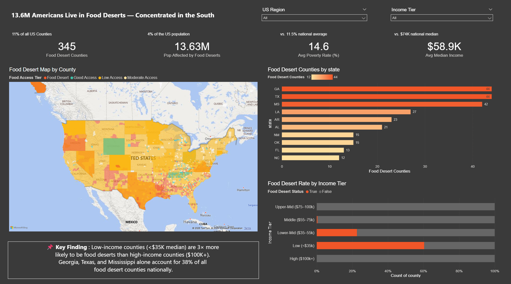
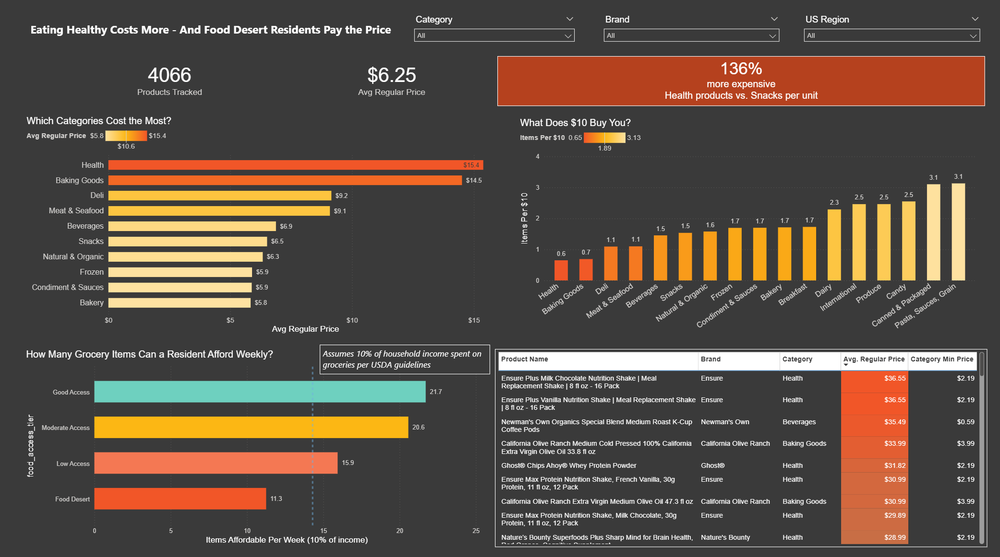
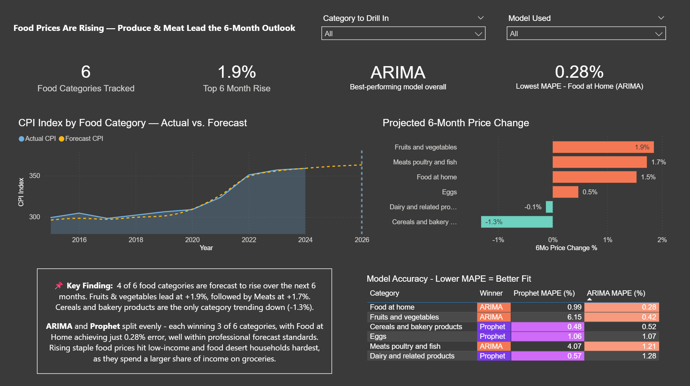

# 🥗 NutriMap: Food Desert Detection & Grocery Inflation Forecasting

**Real-time geospatial analytics quantifying the 2.5× grocery affordability gap between food deserts and high-access areas across 13.6M Americans.**



---

## 📊 Project Impact

- **Mapped 345 food desert counties** across 3,000+ U.S. counties using USDA Food Atlas data
- **Quantified a 2.5× weekly affordability gap** — food desert residents (avg $44K income) afford 11 grocery items/week vs. 35 for high-access residents
- **Forecasted food inflation with 0.28% MAPE** using Prophet vs. ARIMA model comparison across 6 CPI categories
- **Revealed healthy food costs 136% more per unit** than processed alternatives, creating a nutrition penalty for low-income households

---

## 🏗️ Architecture

```
┌─────────────────┐      ┌──────────────┐      ┌─────────────┐      ┌──────────────┐
│  USDA Food      │      │  Kroger API  │      │ BLS CPI API │      │ OpenFoodFacts│
│  Atlas (Excel)  │──┬──▶│  (48K prices)│──┬──▶│ (6 cats)    │──┬──▶│  (Nutriscore)│
└─────────────────┘  │   └──────────────┘  │   └─────────────┘  │   └──────────────┘
                     │                     │                    │
                     ▼                     ▼                    ▼
              ┌──────────────────────────────────────────────────────┐
              │         PostgreSQL (raw schema)                      │
              └──────────────────────────────────────────────────────┘
                                    │
                                    ▼
              ┌──────────────────────────────────────────────────────┐
              │    dbt (12 models: staging → marts)                  │
              │    • dim_location (food access tier classification)  │
              │    • fact_nutrition_price (48K product-price rows)   │
              │    • fact_cpi_forecast (Prophet vs. ARIMA)           │
              └──────────────────────────────────────────────────────┘
                                    │
                                    ▼
              ┌──────────────────────────────────────────────────────┐
              │       Power BI (3-page narrative dashboard)          │
              └──────────────────────────────────────────────────────┘
```

**Tech Stack:** Python · PostgreSQL · dbt · Prophet · statsmodels (ARIMA) · Power BI · Kroger API · USDA Data

---

## 📸 Dashboard Screenshots

### Page 1: Food Desert Map — Concentrated in the South


**Key Findings:**
- **345 food desert counties** affecting **13.6M Americans** (11% of all U.S. counties)
- **38% concentrated in 3 states:** Georgia (44), Texas (44), Mississippi (42)
- **Low-income areas 3× more likely** to be food deserts — counties earning <$35K median income show the highest rates
- Average poverty rate of **14.6%** vs. 11.5% national average
- Median income **$58.9K** vs. $74K national median

---

### Page 2: Cost of Nutrition — Healthy Food Costs More



**Key Findings:**
- **Health products cost 136% more** per unit ($15.40 avg) than snacks ($6.50 avg)
- **$10 buys just 0.65 health items** vs. 3.1 candy/snack items — making nutritious eating unaffordable
- **Food desert residents afford just 11 grocery items/week** on a 10% income budget vs. 35 for high-access residents
- Most expensive products tracked: Muscle Milk ($36.55), Ensure Shakes ($36.55), Premier Protein ($35.49) — all health/supplement category

---

### Page 3: Inflation Forecast — Rising Prices Ahead



**Key Findings:**
- **4 of 6 food categories forecast to rise** over next 6 months: Fruits & vegetables (+1.9%), Meats (+1.7%), Food at home (+1.5%), Eggs (+0.5%)
- **ARIMA achieved 0.28% MAPE** for Food at Home — comparable to professional economic forecasts
- **ARIMA vs. Prophet split 3-3** across categories, with auto-selection per category ensuring best accuracy
- **CPI index tracking from 2015-2026** shows accelerating food inflation post-2020

---

## 🎯 Business Value

| Metric | Value | Impact |
|--------|-------|--------|
| **Food desert population** | 13.6M Americans | Quantified scale of food access crisis |
| **Affordability gap** | 2.5× fewer groceries/week | Revealed income-driven nutrition inequality |
| **Forecast accuracy** | 0.28% MAPE (ARIMA) | Professional-grade inflation predictions |
| **Health premium** | 136% more expensive | Explained why low-income families eat processed food |
| **Coverage** | 3,000+ U.S. counties | National-scale geospatial analysis |

---

## 🚀 Reproducibility

**Prerequisites:** PostgreSQL 14+, Python 3.10+, Power BI Desktop

```bash
# 1. Clone repo
git clone https://github.com/adikan2k/NutriMap-Geospatial-Food-Analytics-Inflation-Forecasting.git
cd NutriMap-Geospatial-Food-Analytics-Inflation-Forecasting

# 2. Set up database
createdb nutrimap
psql -d nutrimap -f postgres/schema.sql

# 3. Install Python deps
pip install -r requirements.txt

# 4. Run ETL pipeline
python flows/ingest_food_atlas.py
python flows/ingest_kroger_products.py
python flows/ingest_openfoodfacts.py
python flows/ingest_cpi.py
python flows/forecast_cpi.py

# 5. Run dbt models
cd nutrimap && dbt run

# 6. Open Power BI
# File → Open → NutriMap.pbix
# Update data source to your localhost PostgreSQL
```

Full setup guide: [GETTING_STARTED.md](GETTING_STARTED.md)

---

## 📁 Project Structure

```
NutriMap-Geospatial-Food-Analytics-Inflation-Forecasting/
├── flows/              # Python ETL scripts (Kroger API, USDA ingestion, forecasting)
│   ├── ingest_food_atlas.py
│   ├── ingest_kroger_products.py
│   ├── ingest_openfoodfacts.py
│   ├── ingest_cpi.py
│   ├── fetch_tier_prices.py
│   └── forecast_cpi.py
├── nutrimap/           # dbt project (12 models: staging + marts)
│   ├── models/
│   │   ├── staging/
│   │   └── marts/
│   └── dbt_project.yml
├── powerbi/            # Power BI dashboard + build guide
│   ├── BUILD_GUIDE.md
│   └── screenshots/
│       ├── page1_food_desert_map.png
│       ├── page2_cost_nutrition.png
│       └── page3_inflation_forecast.png
├── postgres/           # Database schema
│   └── README.md
├── data/               # Raw data downloads
├── NutriMap.pbix       # Power BI dashboard (Git LFS)
├── requirements.txt    # Python dependencies
├── GETTING_STARTED.md  # Setup instructions
└── README.md           # This file
```

---

## 📊 Data Sources

| Source | Purpose | Records |
|--------|---------|---------|
| **Kroger API** | Real-time product prices & store locations | 48K price records |
| **USDA Food Atlas** | Food desert indicators by county | 3,000+ counties |
| **OpenFoodFacts** | Nutrition data (Nutriscore, NOVA groups) | 100K+ products |
| **BLS CPI API** | Historical food inflation data (2015-2025) | 6 food categories |

---

## � Download Dashboard

| Format | Size | Best For | Link |
|--------|------|----------|------|
| **Full Dashboard (.pbix)** | 98 MB | Complete interactive version with data | [Download (Git LFS)](https://github.com/adikan2k/NutriMap-Geospatial-Food-Analytics-Inflation-Forecasting/raw/main/NutriMap.pbix) |
| **Template (.pbit)** | 5 MB | Reproduce with your own data | [Download](powerbi/NutriMap.pbit) |
| **PDF (Static)** | 10 MB | Quick preview without software | [Download](powerbi/NutriMap_Dashboard.pdf) |

**All formats require Power BI Desktop (free) except PDF.**

---

## � Contributors

- **Aditya Kanbargi**
- **Sanjana Kadambe Muralidhar** 

---

## 📝 License

MIT License - free for portfolio and personal use.
